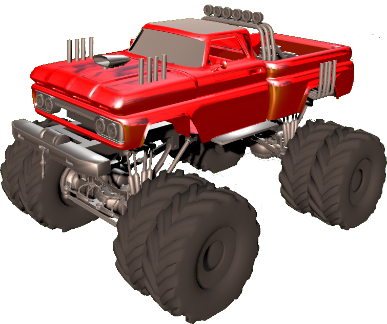

# Monster Truck

## Demo [https://monster-truck.pilow.fr](https://monster-truck.pilow.fr)



This project is a demonstration mini-game designed with Three.js and Bullets Physics to test a number of features and aspects, such as :
- 3D model display (monster truck and trees)
- Drop shadows
- Reflections of the environment on the truck's metallic paintwork
- 3D physics: terrain created in Blender, crates and vehicle (I manually implemented the wheels and suspension)
- Sun reflection in camera (Lens Flare)
- Reflection in an object
- Cone-shaped light (spotlight)
- Vehicle customization: color and suspension.

## Run

```
npm run dev
```

## Build

```
npm run build
```

